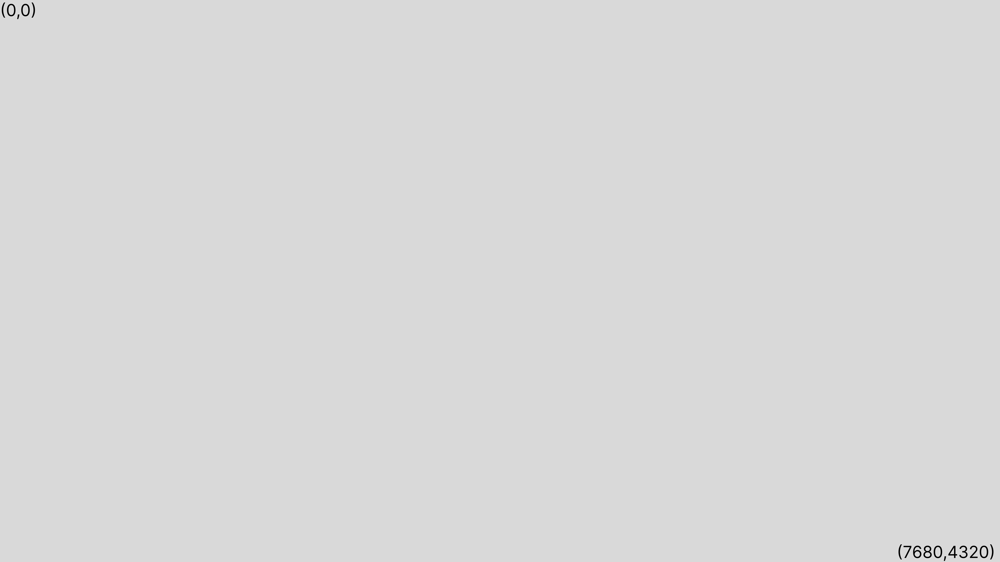
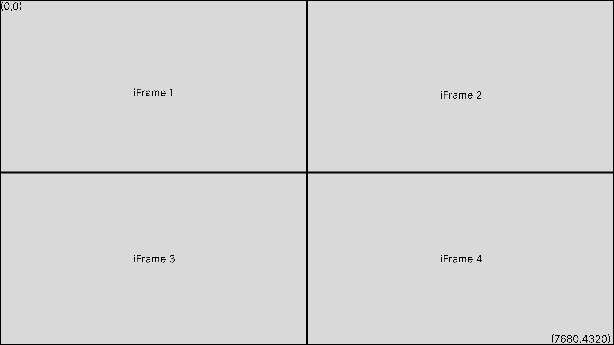
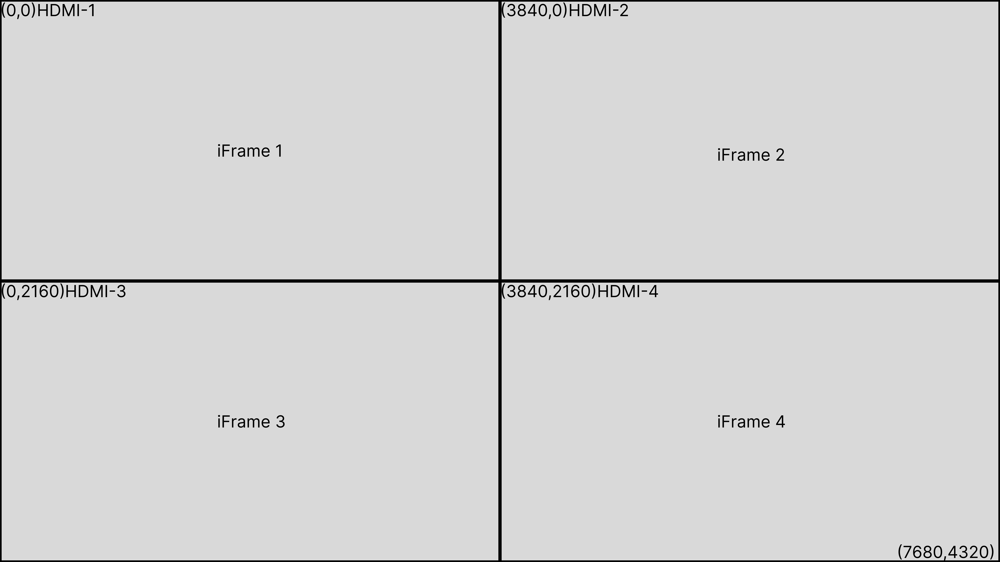

# Example HTML widget across multiple outputs

This repo will show you the best practice for splitting an HTML widget across multiple outputs. This is intended to be developed on your local machine, run and tested on a BrightSign unit. 

You do not need to use BrightAuthor:connected for any step in this process.  This is intended for development purposes ONLY and productizing your application will require additional steps.  The settings applied in this guide should NOT be used on production players.

This is intended for software developers and assumes a general level of knowledge working at the command line and developing web applications.


### Initializing the Repo

After cloning the repo and changing to it's directory, do the following:

```
npm i
```

## Development
This readme contains everything you need to learn how to split a large HTML canvas across multiple HDMI outputs. In order to build, deploy and edit the contained app, follow these steps (assuming the repo is initialized):

1. Prepare your player
    1. What exactly you do in this step is up to you. There are many player configurations, and how exactly your player is set up is based on your project, goals and preferences. You'll find steps to configure your player in ways that BrightSign finds helpful in the [Preparing the Player](#preparing-the-player) section, as well as full configuration options in the [BrightSign Docs](https://brightsign.atlassian.net/wiki/spaces/DOC/overview?homepageId=370671585).
2. [Build the app](#building-the-app)
3. [Deploy code to your player](#deploying-code-to-player)
4. [Edit the app to fit your project](#splitting-the-html-app-across-hdmi-outs)


## Preparing the Player

Your player needs to be setup to enable serial, DWS and debugging. It's also usually a good idea to start with a player that is freshly factory reset.

### Enabling Serial

You will need a serial cable and adapter for your computer.  Once connected, use the serial software of your choice (on linux and Mac, the "screen" command is quite popular and all you need).

Power on the player with the SVC button pressed.  Be near your keyboard because in a few seconds you will see:

```bash
Automatic startup in 3 seconds, press Ctrl-C to interrupt.
```

Press Ctrl-C and you will see a prompt that says SECURE or BOLT (depending on the player model).  Type these commands:

```bash
console on
reboot
```

### Enabling Debug

Reboot the player and you will see logs on serial session.  Press the SVC button and it will drop you to a BrightSign prompt.  Type:

```
script debug on
registry write html enable_web_inspector 1
```

### Disabling Control Cloud

If you want to avoid the player interacting with BSN.cloud while you are developing, you can put the player totally in local mode with this:

```
registry write !supervisor.brightsignnetwork.com bsnce false
```

## Building the app
This app uses webpack to compile all of the necessary javascript into a single file to be run on the player. This file must be built by webpack, to do so run:
```bash
npm run build:dev
```
This will build a dev-version of the bundled code in a /dist/ folder within the working directory. The bundle.js file within /dist/ is the javascript code that the player will run. 

To build minified code with webpack, run:
```bash
npm run build
```

## Deploying code to player
How exactly you deploy this code to the player is up to you. Officially, BrightSign recommends manually adding the required file(s) to the SD card. However, there are localDWS API's that make pushing files to the player easy. You can do this manually from the lDWS front end on the 'SD' page, use your own file pushing program, or use the BrightSign CLI that is currently being worked on: [brightsign CLI](https://github.com/brightsign/player-cli/tree/pe-28-fetch-implementation). For access to, or information about, the (WIP) CLI please reach out to the Partner Engineering team. 

### What to upload to the player
There are three important files that must be put on the player's storage in order to run the web app. The first is autorun.brs, which goes in the root of the file tree. Next, bundle.js and index.html (from local /dist, once the webpack app has been built) must be put into a /dist folder on the player. 

Using the BrightSign player-cli, assuming you have set up your player config:
```bash
bsc push playerName src/autorun.brs
bsc push playerName dist dist
```

These three commands will push the required files to the correct places on the SD card. 

Once the files are in the correct place on the SD card, run the app. Either reboot the player or refer to [restarting the app on the player](#restarting-the-app-on-the-player).

## Splitting the HTML app across HDMI outs
There are three distinct sections involved in splitting HDMI outputs across a canvas:
1. The canvas
    1. In this case, the canvas is the roHTMLwidget and is configured using BrightScript in the autorun. 
        1. Note that it's possible to create and configure the HTML widget with javascript ([JS HTML widget](https://brightsign.atlassian.net/wiki/spaces/DOC/pages/388435279/htmlwidget)). However, in this initial example the HTML is configured in BrightScript. 
    1. The 'canvas' refers to the output in its entirety. So, for example, if you have four 4k monitors in a 2x2 configuration, the canvas should be 8k (7680x4320px). If you have four 4k monitors in a 4x1 configuration, the canvas should be 15360x2160px. 
    1. As said previously, in this example the canvas is configured with BrightScript. Specifically on line 34 of /src/autorun.brs:
    ```
    r = CreateObject("roRectangle",0,0,7680,4320)
    ```
    This line creates an 8k rectangle. The HTML widget is built on top of this rectangle, creating the canvas. To edit the canvas size, change this line. the 0,0 refers to the starting point of the canvas (in this case, it should always be 0,0, or the top left origin point), while the next two values refer to the size. More information on configuring the roHtmlWidget can be found [here](https://brightsign.atlassian.net/wiki/spaces/DOC/pages/370672896/roHtmlWidget).
    
2. The 'containers'
    1. 'Containers' refers to the iFrames that contain media within the canvas, and are defined within the HTML file.
        2.1.1. /src/index.html contains the iFrame definitions, specifically the CSS
    2. iFrames are set up using a grid, and this is seen on lines 15 and 16 of /src/index.html:
    ```
    grid-template-columns: 1fr 1fr;
    grid-template-rows: 1fr 1fr;
    ```
    Here, a 2 row by 2 column grid is made. Each iFrame is centered within its grid square with:
    ```
    align-items: center;
    justify-items: center;
    ```
    2. Each iFrame's size can be changed:
    ```
    iframe {
      width: 3840px;
      height: 2160px;
      border: 5px solid black;
      display: block;
      margin: auto;
    }
    ```
    Changing the width and height settings change the size of the iFrame. Note that for proper rendering, each iFrame cannot be larger than the resolution of the monitor it is being displayed on. 
    
3. The 'windows'
    1. 'Windows' in this context refers to the HDMI outputs. Each HDMI output can be considered a 'window' or 'view port' onto the canvas. 
        1. By default (without explicitly setting HDMI outputs) the entire canvas will be displayed on HDMI-1. If the canvas is larger than the resolution of the monitor plugged into HDMI-1, then the first resX by resY will be output over HDMI-1, starting at the origin.
    3. Windows must be configured. In this example, HDMI-1 will be a window viewing the first 3840x2160px, starting at origin, while HDMI-2 will be a window viewing the second 3840x2160px, starting at (3840,0), and so on.
        1. HDMI output is configured in the screenModeConfig function. The screenModeConfig variable is a nested array, with each index containing information about the video output associated with the index (index 0 is HDMI-1, etc). 
        3. For this example, HDMI-1 is configured as 3840x2160px:
        ```
        setModesConfig[0].videoMode = "3840x2160x60p";
        ```
        and HDMI-2 is configured as 3840x2160px, but starting 3840px across the canvas:
        ```
        setModesConfig[1].enabled = true;
        setModesConfig[1].screenX = 3840;
        setModesConfig[1].screenY = 0;
        setModesConfig[1].transform = "normal";
        setModesConfig[1].videoMode = "3840x2160x60p";
        ```
        3. There is a known issue where getScreenModes function only returns the active outputs. So, for more than HDMI-1 and 2, you need to add the other outputs manually. In order to do this:
        
        ```
        //Account for more than 2 outputs and current return bug
        setModesConfig[2] = {...setModesConfig[0]};
        setModesConfig[3] = {...setModesConfig[0]};
        //Set third output
        setModesConfig[2].outputName = "HDMI-3";
        setModesConfig[2].enabled = true;
        setModesConfig[2].screenX = 0;
        setModesConfig[2].screenY = 2160;
        setModesConfig[2].transform = "normal";
        setModesConfig[2].videoMode = "3840x2160x60p";
        //Set fourth output
        setModesConfig[3].outputName = "HDMI-4";
        setModesConfig[3].enabled = true;
        setModesConfig[3].screenX = 3840;
        setModesConfig[3].screenY = 2160;
        setModesConfig[3].transform = "normal";
        setModesConfig[3].videoMode = "3840x2160x60p";
        ```
        

Following these steps will allow you to create a 2x2 video wall consisting of 4k monitors. For any questions, please reach out to the partner engineering team at BrightSign.

